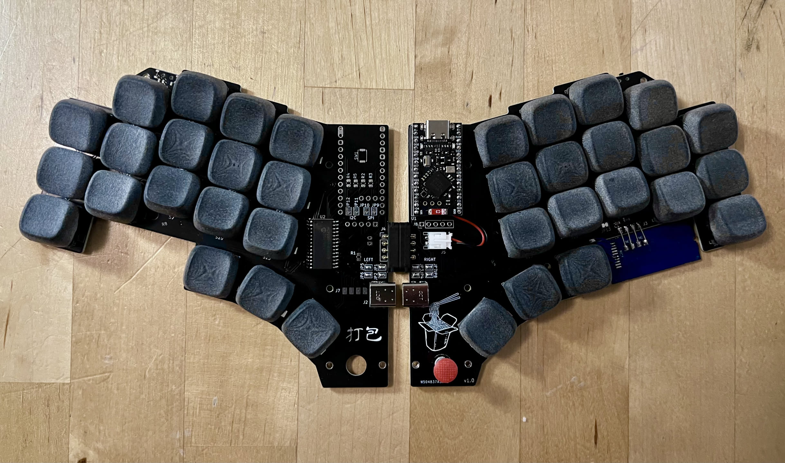
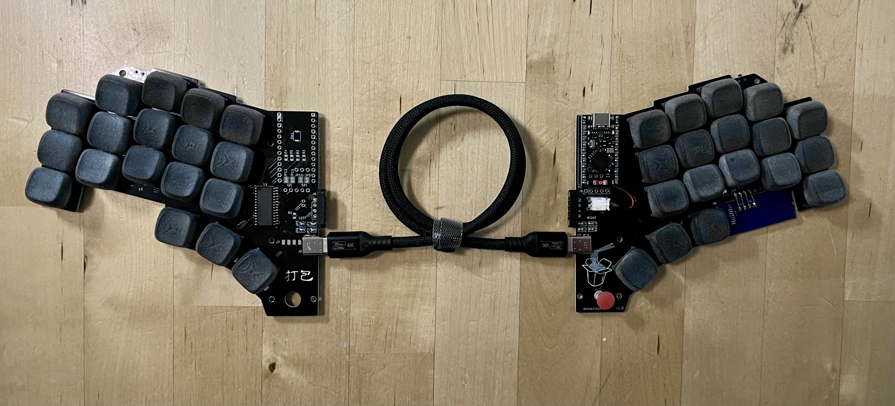

# dabao
打包 (dǎ bāo or daa2 baau1), which means to takeout (food) in Chinese, is a wireless, portable 36-key keyboard with a thumb trackpoint, designed for maximum flexibility and convenience.

> 
> Keyboard can be used as a unibody...
>
> 
> ... or as a split!

> [!WARNING]
> This project is currently a work in progress. Please note that these files are provided as-is, and use is at your own discretion.

## Features
- **Unibody or Split:** Unique magnetic 4-pin connector allows the keyboard to be used as a single unibody or split into two halves via a USB-C cable. Use unibody mode on the go, and split mode at your desk!
- **Wireless:** Fully wireless operation for portability.
- **Single Microcontroller:** Uses one microcontroller and an MCP23017 GPIO expander, eliminating the need for two controllers or batteries to reduce costs and avoid managing uneven battery discharge.
- **Thumb Trackpoint:** Integrated for precise cursor control.
- **Reversible PCB:** Keeps it affordable and enables the trackpoint to be installed on the left or right side

## Case

*Coming soon!* The case will make the magnetic interface more robust, which will allow the keyboard to be lifted from either side without it collapsing in half. Additional magnets will likely be added to make the connection more secure.

## Firmware

See [zmk-config](https://github.com/justinmklam/zmk-config).

## Build Guide
*Coming soon!*

## Acknowledgements

This design was inspired by the following keyboards:
- [TPS42](https://github.com/crehmann/TPS42)
- [duet](https://github.com/zzeneg/duet)
- [Santoku](https://www.reddit.com/r/ErgoMechKeyboards/comments/oisnad/i_made_this_santoku_gen_2_trackpoint_as_a/?chainedPosts=t3_g4m3f6)

Helpful trackpoint resources:
- [infused-kim's Trackpoint Driver](https://github.com/infused-kim/kb_zmk_ps2_mouse_trackpoint_driver) - outdated for the recent versions of zmk, but still a treasure trove of information
- [Jorne Trackpoint Wiki](https://github.com/joric/jorne/wiki/Tracking)
- [TheMK Wiki - TrackPoint Overview](https://wiki.themk.org/index.php/TrackPoint)
- [KBD News - Trackpoint Integration Guide](https://kbd.news/How-to-integrate-a-trackpoint-into-your-keyboard-2447.html)
- [r/Trackpoint_Builders](https://www.reddit.com/r/TrackPoint_Builders/)
- [Trackpoint Builders Discord](https://discord.gg/48gM4jZkW)

## Support

Thank you to my current sponsors for making this project possible!

